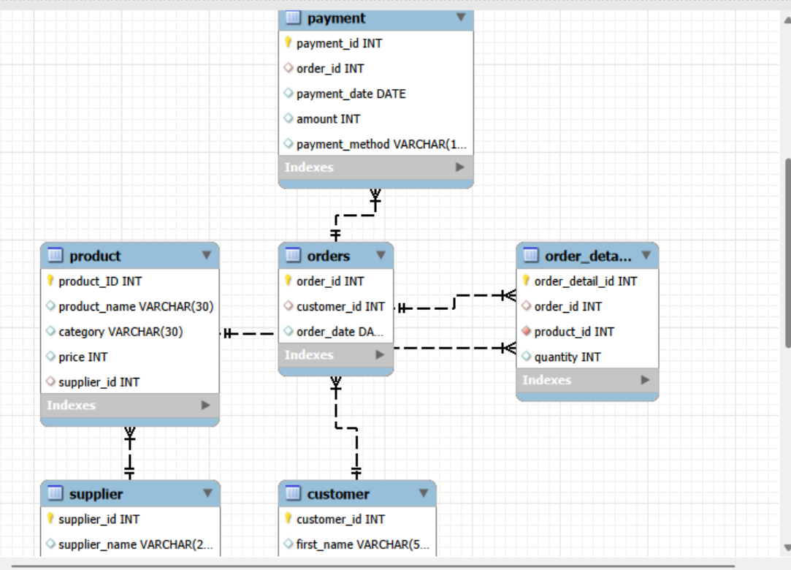
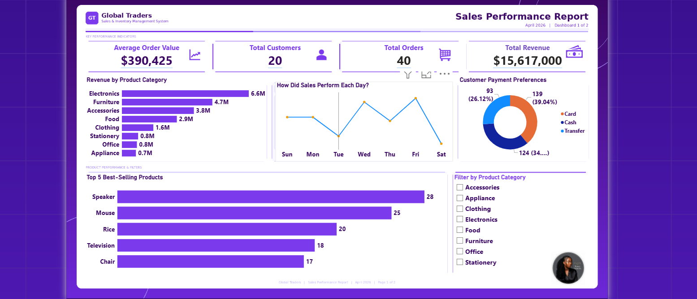
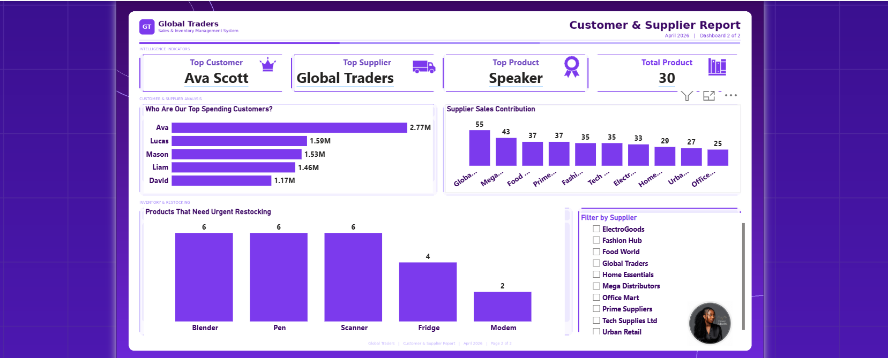

# SALES & INVENTORY MANAGEMENT SYSTEM
# SQL Database Design · Business Intelligence · Power BI Dashboard
---

# Table of Contents
---
- [Project Overview](#project-overview)
- [Business Problem](#business-problem)
- [Objectives](#objectives)
- [Database Design](#database-design)
- [Dataset Overview](#dataset-overview)
- [Tools Used](#tools-used)
- [Database Creation & Data Insertion](#database-creation--data-insertion)
- [Skills Demonstrated](#skills-demonstrated)
- [KPI Overview](#kpi-overview)
- [Business Insights](#business-insights)
- [Recommendations](#recommendations)
- [Dashboard](#dashboard)
- [Conclusion](#conclusion)

---

## Project Overview
---
Most businesses collect data every day but without
a proper system to store and query that data, the
information is useless.

This project involves designing and building a
complete Sales and Inventory Management System
from scratch using SQL for Global Traders a
retail business that sells products to customers
through multiple suppliers.

The system was built to track customer orders,
product performance, supplier activity, payments
and inventory then queried to answer real
business questions that management needs answered
every week.

| Stat | Value |
|------|-------|
| Database Name | sales_inventory_system |
| Total Tables | 6 |
| Total Records | 170+ |
| SQL Queries Written | 20+ |
| Dashboards Built | 2 |

---

## Business Problem

Global Traders had no centralised system to answer
basic but critical business questions:

- Which products are selling the most?
- Who are our most valuable customers?
- Which products need restocking urgently?
- Which suppliers are performing best?
- How much revenue is the business generating
  daily and monthly?

Without answers to these questions, decisions were
being made on guesswork not data. This project
fixes that.

---

## Objectives

- Design a normalised relational database that
  accurately models the business
- Populate the database with realistic retail data
- Write SQL queries that answer real management
  questions across sales, customers, products
  and suppliers
- Build a Power BI dashboard to visualise the
  findings for non-technical stakeholders

---

## Tools Used

- **MySQL:** Used to write all SQL queries,
  database creation, table design, data insertion
  and business intelligence queries
- **Power BI:** Used to build 2 interactive
  dashboards visualising revenue, product
  performance, customer intelligence and
  supplier contribution
- **Power Query (in Power BI):** Used for data
  transformation before visualisation
  
---
## Database Development

- Designed and developed a relational database to support sales and inventory operations.
- Created six business tables representing customers, suppliers, products, orders, order details, and payments.
- Populated the database with realistic retail data to simulate day-to-day business transactions.
- Validated the dataset to ensure consistency and reliability before performing SQL analysis.

---

## Skills Demonstrated

- Relational Database Design
- Data Modeling and Table Creation
- Data Validation and Integrity Checks
- Multi-table JOIN Queries
- Window Functions (`RANK() OVER`)
- Aggregate Functions (`SUM`, `COUNT`, `AVG`, `GROUP BY`)
- Data Filtering (`WHERE`, `HAVING`, `IS NULL`)
- Subqueries and Correlated Subqueries
- Date and Time Functions
- Business Intelligence Query Writing
- Power BI Dashboard Development
- Data Storytelling and Business Communication
  
---

## Key Business Insights

### 1. How much revenue is the business generating?

The business generated **₦15.6M** in total revenue across **40 orders** from **20 customers**, resulting in an average order value of **₦390,000**. The high average transaction value demonstrates strong customer spending and highlights the importance of maintaining customer retention and consistent sales performance.

---

### 2. Which products are selling the most?

Speaker is the best-selling product with **28 units sold**, followed by Mouse with **25 units**. Electronics is the highest-performing category overall, while Rice leads within the Food category. These products are the primary drivers of sales and should remain a key focus for inventory planning.

---

### 3. Who are our most valuable customers?

The top three customers contribute a significant share of total revenue, with **Ava Scott** spending **₦2,774,000**. Retaining these high-value customers is essential for sustaining revenue growth and strengthening long-term business performance.

---

### 4. Which products need restocking urgently?

Speaker, Mouse, and Rice recorded the highest sales volumes, reflecting strong and consistent customer demand. Prioritising inventory replenishment for these products will help minimise stockouts and reduce the risk of lost sales.

---

### 5. Which suppliers are performing best?

Global Traders supplied the highest sales volume, followed by Mega Distributors and Food World. While these suppliers play an important role in supporting business operations, monitoring supplier dependency can help improve supply chain resilience and reduce operational risk.

---
## Recommendations

- **Prioritise Inventory Management:** Maintain adequate stock of Speaker, Mouse, and Rice to reduce stockouts and lost sales.

- **Strengthen Customer Retention:** Introduce loyalty initiatives for high-value customers to encourage repeat purchases.

- **Expand the Electronics Category:** Increase product variety and inventory to maximise revenue opportunities.

- **Optimise Supplier Partnerships:** Negotiate better pricing with top suppliers to improve profit margins.

- **Diversify the Supplier Base:** Reduce supplier dependency to strengthen supply chain resilience.
---
## Dashboard

Two interactive Power BI dashboards were developed to present the analysis and support business decision-making for non-technical stakeholders.

### Sales Performance Dashboard

Visualises revenue trends, product category performance, best-selling products, daily sales patterns, and payment method distribution.

---

### Customer & Supplier Dashboard

Highlights top customers, supplier performance, and inventory items requiring replenishment to support customer retention and supply chain decisions.

---
## Conclusion
---
This project demonstrates that a well-designed
database is not just a technical achievement,
it is a business tool.

In under 20 SQL queries, Global Traders now
knows exactly which products are driving revenue,
which customers are most valuable, which suppliers
are performing best and which products need
restocking before stock runs out.

The Power BI dashboards make all of this
accessible to anyone in the business no SQL
knowledge required.

This is what data analysis is supposed to do:
turn raw records into decisions that move the
business forward.

---

Thank you for reading!

Let's connect:

[LinkedIn](https://www.linkedin.com/in/peace-ada-95b341341)
[Portfolio](https://peace-ada.github.io/Data-Portfolio/)
[Email](mailto:peaceada100@gmail.com)
